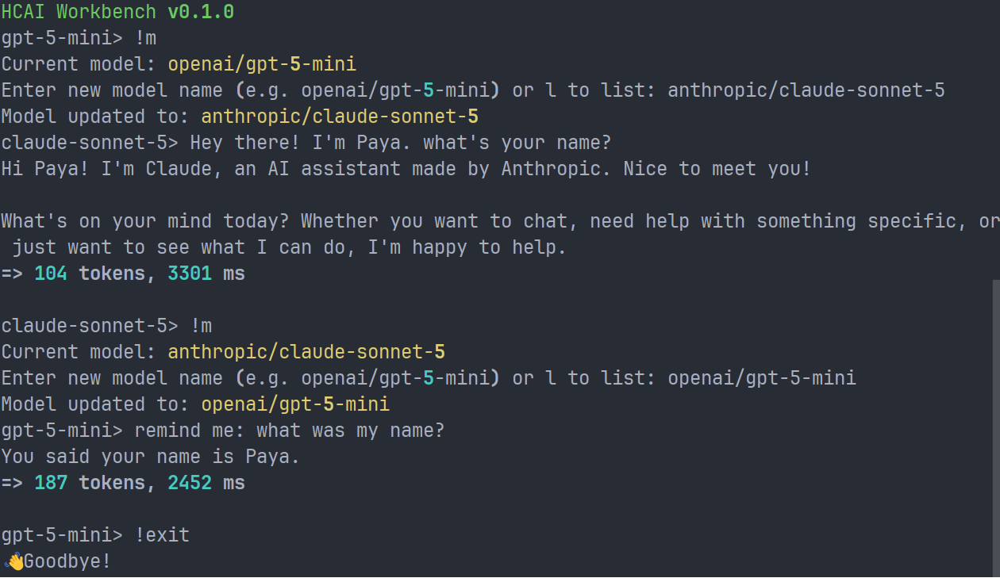

# HCAI Workbench

### _Chat interface for ai.hackclub.com_
HCAI Workbench is a cross-platform application designed to make AI chat simple. It integrates with the ai.hackclub.com API to allow teenagers free AI access.

### Builtin commands:
- !exit, !quit, !q, !bye - Exit the application
- !clear, !cls - Clear the console
- !model, !m - Change the current model
- !config, !cfg - Show configuration file location
- !context, !ctx - Show or reset the current context
- !help, !h - Show this help message

### First run
On the first run, HCAI Workbench will ask you for an API key. If you haven't already, go generate one at https://ai.hackclub.com/keys.

### In action

## Development

### Required features

- [ ] ~~Simple interface (GUI/TUI)~~ ← I decided not to proceed with this for now, as I have had an interesting idea for a future project involving a... discord bot?
- [x] Ability to switch models
- [x] API connection to [ai.hackclub.com](https://ai.hackclub.com/) through OpenRouter
- [x] ~~TOML~~ <ins>CFG</ins> config file

### Optional but desired

- [x] Chat history
  - [x] Ability to clear context
- [ ] Advanced interface (tabs, etc.)
- [ ] Profiles (different api key/model combinations)

## New feature - Experiments!

I was asking the different models the viral "how many Rs in strawberry" prompt to test the app and the switching of models when I thought of something: What if I integrated these sorts of funny experiments into the app itself? Read more and test them out in [the `experiments` module](./src/hcai_workbench/experiments/README.md)
